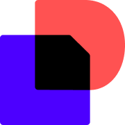

# Holm

**Computer Science @ Arizona State University**  
Software Engineering Intern — prev. Capital One · Mage Legal (YC S24) · DocuSign

I build automation and web-scraping tools

 

<picture>
  <source media="(prefers-color-scheme: dark)" srcset="https://github-readme-stats.vercel.app/api?username=holm-27&show_icons=true&hide_border=false&theme=tokyonight&bg_color=00000000&border_color=30363D&title_color=58A6FF&icon_color=58A6FF&text_color=C9D1D9&card_width=440&include_all_commits=true" />
  
</picture>
<picture>
  <source media="(prefers-color-scheme: dark)" srcset="https://github-readme-stats.vercel.app/api/top-langs/?username=holm-27&layout=compact&langs_count=8&hide=jupyter%20notebook&theme=tokyonight&bg_color=00000000&border_color=30363D&title_color=58A6FF&text_color=C9D1D9&card_width=320" />
  
</picture>

---

### Experience

<table>
  <tr>
    <td width="110" align="center">
      <picture>
        <source media="(prefers-color-scheme: dark)" srcset="assets/logos/capitalone-wordmark-dark.svg" />
        
      </picture>
    </td>
    <td><b><a href="https://www.capitalone.com">Capital One</a></b> Software Engineering Intern</td>
  </tr>
  <tr>
    <td width="110" align="center"></td>
    <td><b><a href="https://mage.legal">Mage Legal</a></b> YC&nbsp;S24 Software Engineering Intern</td>
  </tr>
  <tr>
    <td width="110" align="center"></td>
    <td><b><a href="https://www.docusign.com">DocuSign</a></b> Software Engineering Intern</td>
  </tr>
</table>

---

### What I'm up to

- Writing automation and scraping pipelines that handle the boring parts for me
- Learning my way around larger codebases so I can contribute to open source
- Happy to talk about Python, TypeScript, or anything scraping-related

---

### Tech Stack

<table>
  <tr>
    <td><b>Languages</b></td>
    <td></td>
  </tr>
  <tr>
    <td><b>Frontend</b></td>
    <td></td>
  </tr>
  <tr>
    <td><b>Backend</b></td>
    <td></td>
  </tr>
  <tr>
    <td><b>Data</b></td>
    <td></td>
  </tr>
  <tr>
    <td><b>Cloud &amp; DevOps</b></td>
    <td></td>
  </tr>
  <tr>
    <td><b>Tooling</b></td>
    <td></td>
  </tr>
</table>
